# inkRush

A real-time multiplayer drawing and guessing game inspired by Skribbl.io, built with a retro-futuristic synthwave aesthetic.

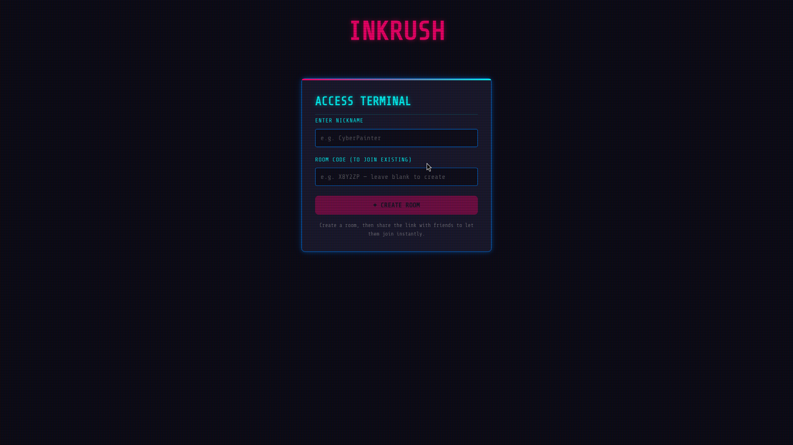

---

## Demo


---

## Screenshots

| Landing | Lobby | Word Selection |
|---------|-------|----------------|
|  | 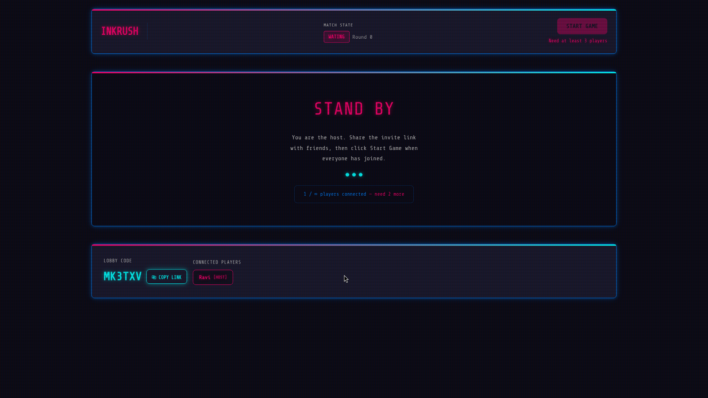 | 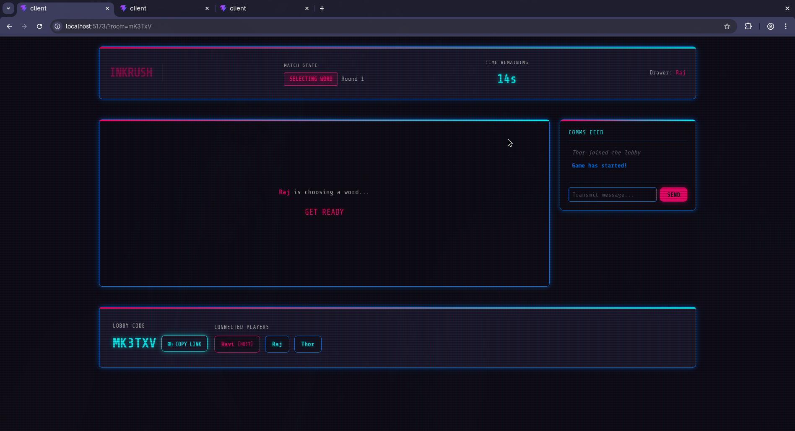 |

| Drawing | Canvas Sync | Scoreboard |
|---------|-------------|------------|
| 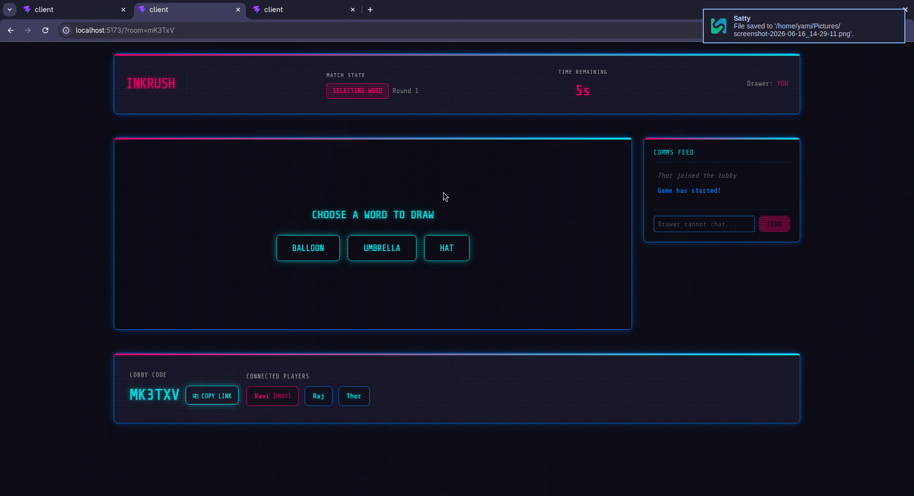 | 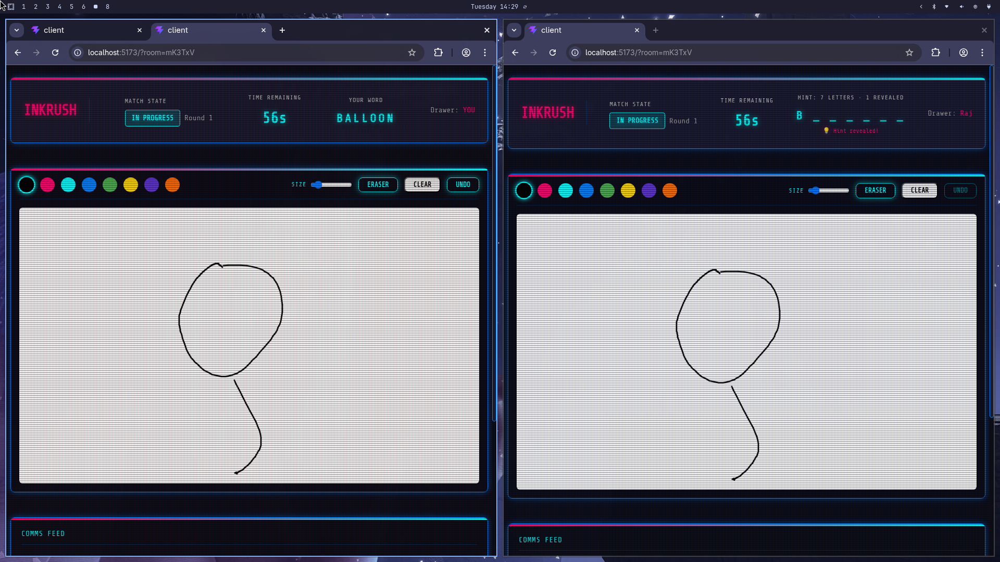 | 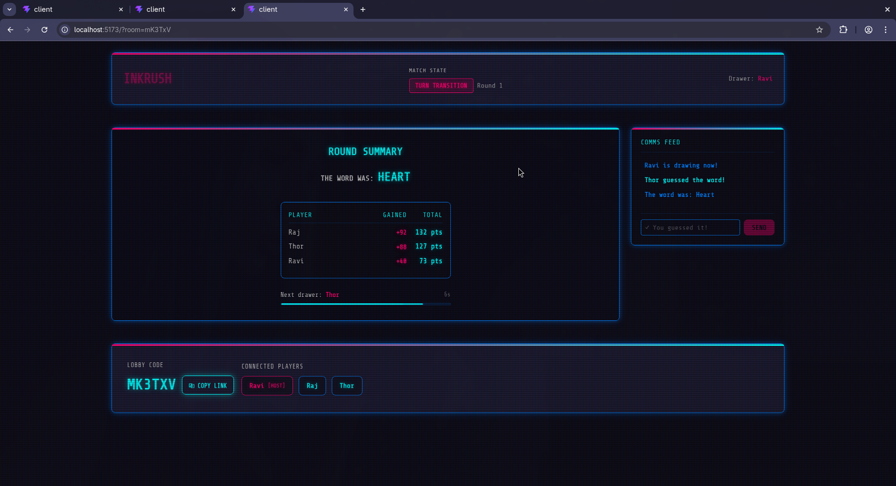 |

| Full Canvas View |
|------------------|
| 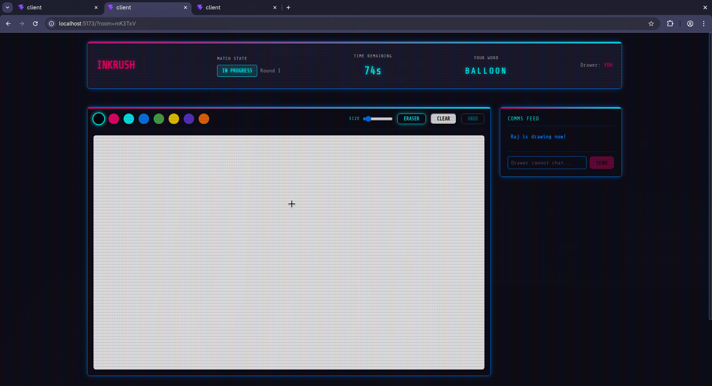 |

---

## Key Features

- **Real-time Synced Canvas** - Instant coordinate broadcast using normalized canvas bounds for consistent rendering across all devices.
- **Room-Based Multiplayer** - Create rooms, share join codes, or send invite links.
- **Live Chat & Guesses** - Dual-purpose panel: standard chat in lobby, correct-guess filtering during turns.
- **Automatic Game Loop** - Server-driven phases (word selection, drawing, turn transition) managed via tick timers.
- **Secure Session IDs** - High-entropy cryptographic strings replace predictable IDs.
- **Robust Disconnect Logic** - Graceful player departure handling with instant turn transitions when the drawer leaves.
- **Client Rate Limiter** - Protects resources by dropping socket message floods.

---

## Tech Stack

### Frontend

| Technology | Purpose |
|------------|---------|
| React + Vite | SPA framework and build tooling |
| HTML5 Canvas API | Interactive drawing (color palette, brush size, eraser, undo) |
| Custom Hooks | Encapsulated WebSocket management (`useWebSocket` + `WebSocketService`) |
| Synthwave Theme | Share Tech Mono font, neon glow animations, CRT scanline overlay |

### Backend

| Technology | Purpose |
|------------|---------|
| Go (Golang) | High-concurrency network runtime |
| Gin Gonic | Web routing and health endpoints |
| Gorilla WebSocket | TCP socket upgrades and frame transmission |
| Thread-Safe Stores | Concurrent in-memory repositories with `sync.Mutex` |

---

## Project Structure

```text
.
├── public/                 # Static assets
│   ├── pics/               # Screenshots and images
│   └── video/              # Demo video
├── client/                 # React frontend application
│   ├── src/
│   │   ├── components/     # UI screens (HomeScreen, Lobby, GameScreen)
│   │   ├── hooks/          # React hooks (useWebSocket.js)
│   │   ├── services/       # Core services (websocket.js)
│   │   ├── index.css       # Retro-futurism theme and styles
│   │   └── App.jsx         # App state coordinator
│   └── dockerfile
├── server/                 # Go backend server
│   ├── cmd/
│   │   └── api/            # main.go entry point
│   ├── internal/
│   │   ├── app/            # App setup and routing engine
│   │   ├── domain/         # Domain models (game, room, player)
│   │   ├── pkg/            # Utility helpers (RandomID, word list/masking)
│   │   ├── store/          # Safe memory store repositories
│   │   └── transport/      # WebSocket server protocols and handler
│   └── dockerfile
├── docs/                   # Full system architecture documentation
├── docker-compose.yml      # Orchestration file
└── README.md               # Root repository guide
```

---

## Architecture & Sequence Diagrams

### 1. Connection, Game Loop, & Reconnect Lifecycle

This sequence diagram illustrates a standard lifecycle from two players joining, launching a game, broadcasting real-time drawings, submitting guesses, and performing a page-refresh reconnection.

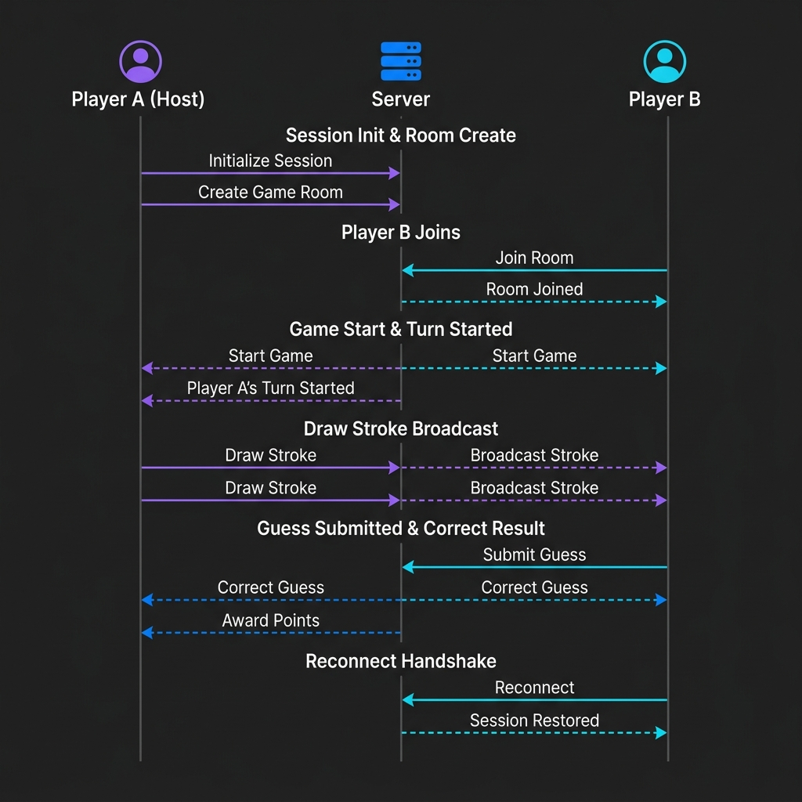

<details>
<summary>View Mermaid Source</summary>

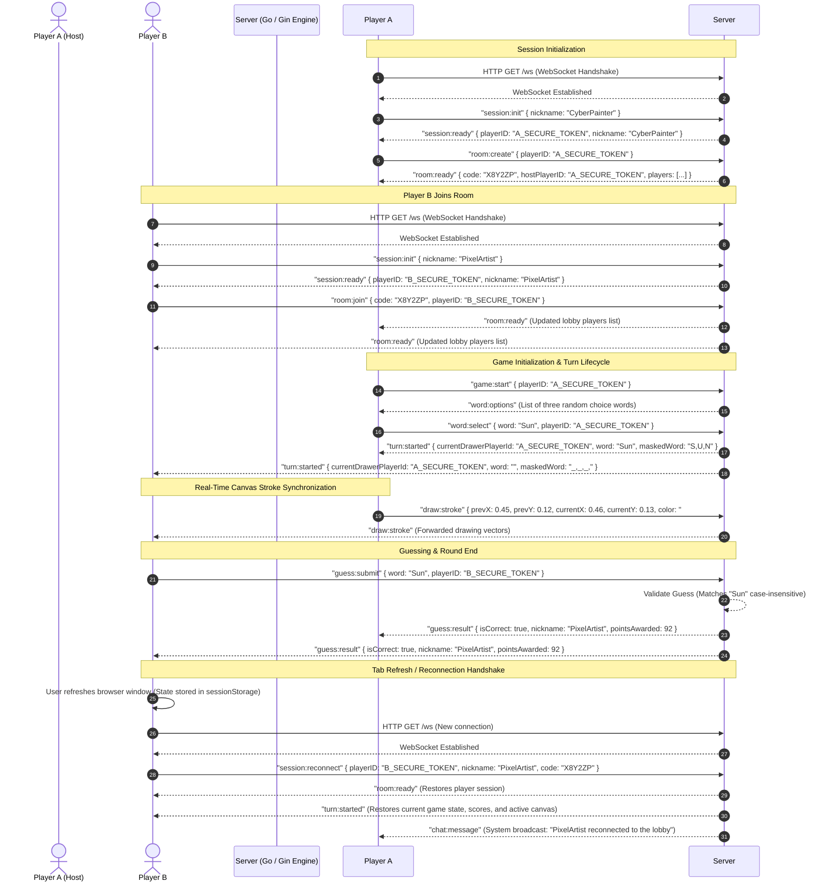
</details>

### 2. Game Phase State Machine

Rooms transition through specific game phases on the backend server. These are communicated to clients via WebSocket state updates.

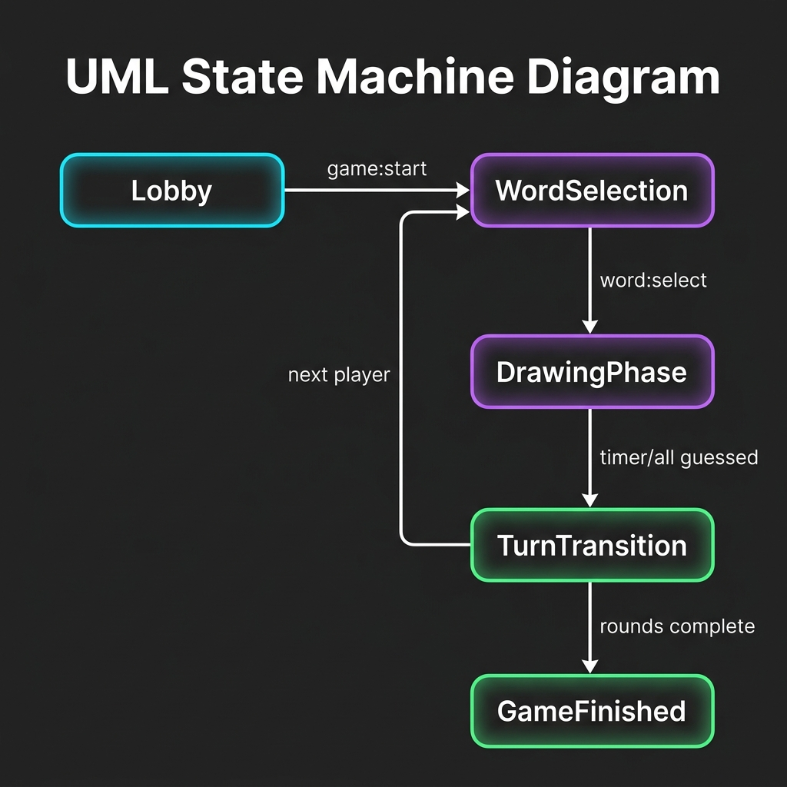

<details>
<summary>View Mermaid Source</summary>

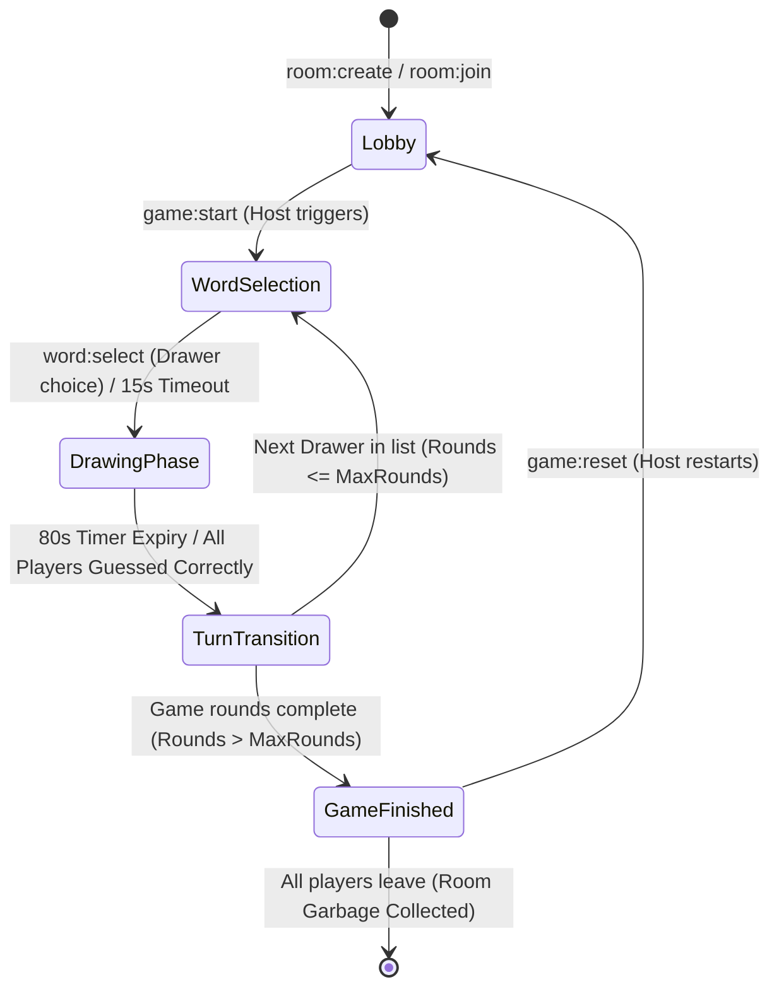
</details>

---

## Quick Start

### Docker Compose (Recommended)

Spin up the entire application with a single command:

```bash
docker compose up --build
```

- **Frontend:** http://localhost:5173
- **Backend:** http://localhost:8080 (WebSocket: `ws://localhost:8080/ws`)

### Local Development

**Backend (Go)**

```bash
cd server
go run ./cmd/api
```

**Frontend (React)**

```bash
cd client
cp .env.sample .env
npm install
npm run dev
```