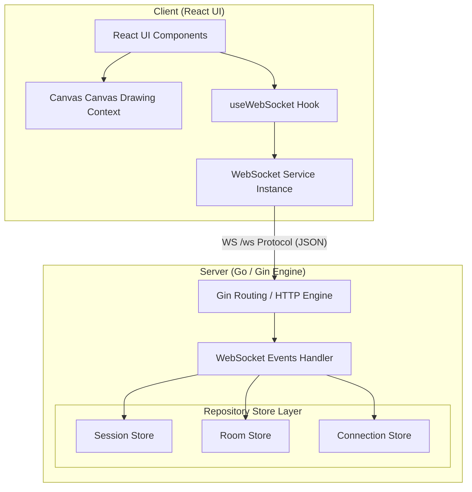

# System Architecture Diagrams

This directory holds references to inkRush system architecture designs.

---

## 📐 Unified Flow & Component Layout

```mermaid
graph TB
    subgraph Client ["Client (React UI)"]
        UI[React UI Components]
        Canvas[Canvas Canvas Drawing Context]
        Hooks[useWebSocket Hook]
        WSClass[WebSocket Service Instance]
        
        UI --> Canvas
        UI --> Hooks
        Hooks --> WSClass
    end

    subgraph Server ["Server (Go / Gin Engine)"]
        GinRouter[Gin Routing / HTTP Engine]
        WSHandler[WebSocket Events Handler]
        
        subgraph Session_Lobby ["Repository Store Layer"]
            SessionStore[Session Store]
            RoomStore[Room Store]
            ConnStore[Connection Store]
        end
        
        GinRouter --> WSHandler
        WSHandler --> SessionStore
        WSHandler --> RoomStore
        WSHandler --> ConnStore
    end

    WSClass -- "WS /ws Protocol (JSON)" --> GinRouter
```
