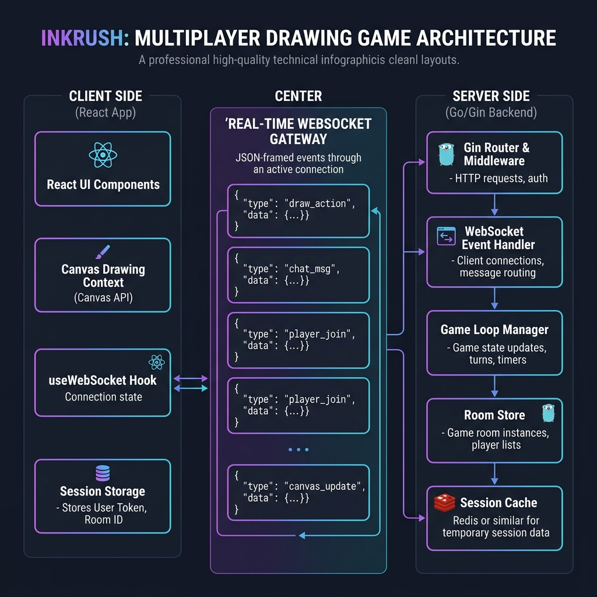
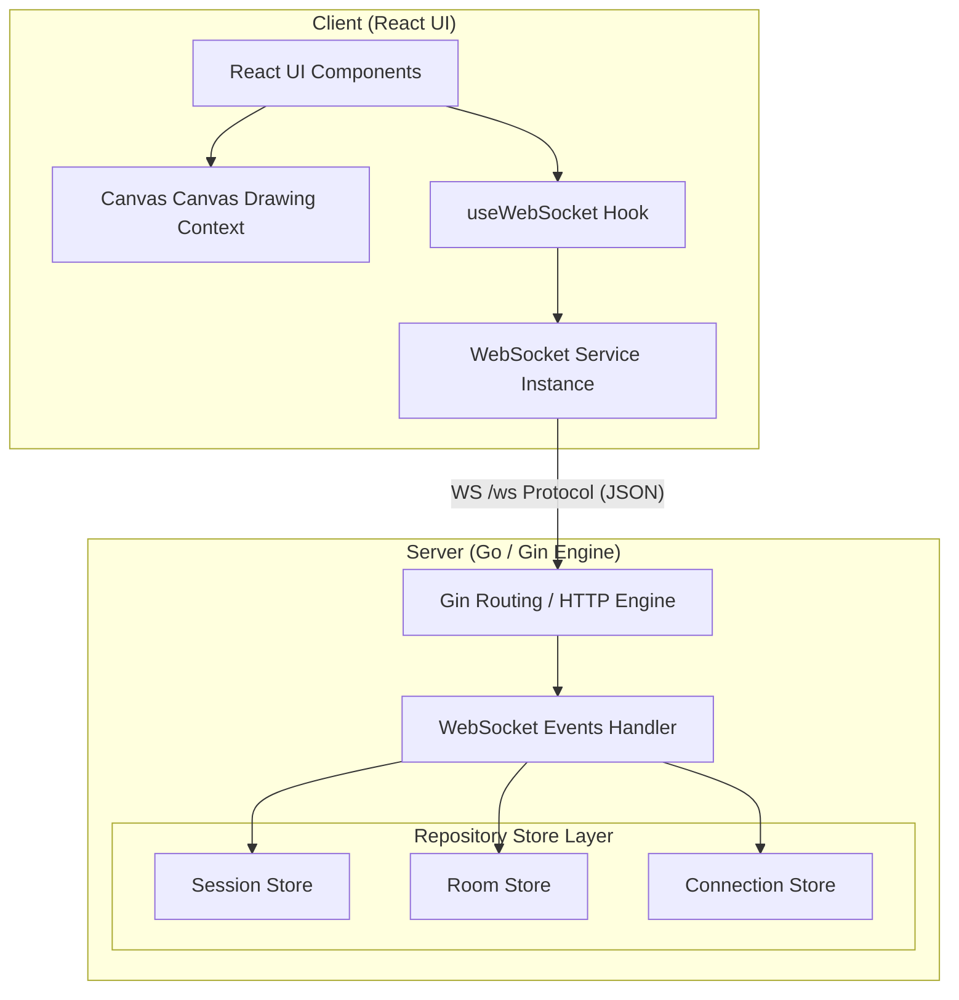

# System Architecture Diagrams

This directory holds references to inkRush system architecture designs.

---

## 🎨 Editorial System Architecture Diagram

Below is a pictorial view of the inkRush client-server design, covering the frontend components, connection protocols, and server stores:

---

## 📐 Unified Flow & Component Layout (Mermaid)

