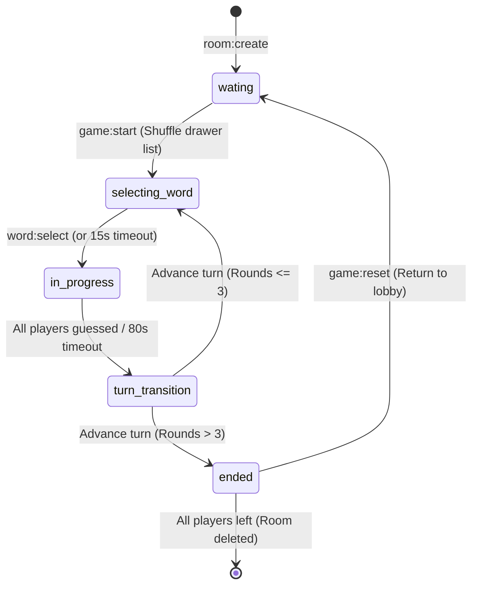

# Room Lifecycle

This document describes the states, transitions, and connection lifecycle events of an **inkRush** multiplayer lobby.

---

## 🔄 Room State Machine

A room is always in one of the following states:

---

## 🔌 Connection Handling Specs

### 1. Ingress & Creation
*   A player logs in with a nickname and gets a secure unique ID.
*   **Host player:** The first player in a lobby becomes the host.
*   **Invite Links:** Sharing `http://localhost:5173/?room=CODE` allows players to join directly.

### 2. Disconnection Recovery
*   If a player drops, their socket closes and the server removes them from the room player list immediately.
*   **Host Migration:** If the host player leaves, the server transfers host privileges to the next player in the list.
*   **Active Drawer Exit:** If the drawer leaves during their active turn:
    1.  The server recalculates `DrawerIndex` (so the turn queue remains synced).
    2.  Pushes a system warning: *"The drawer has disconnected!"*
    3.  Instantly executes `EndDrawingTurn` to end the current turn and transition back to the lobby or the next turn, preventing game freeze.
*   **Empty Lobby:** If all players disconnect, the room is deleted from the server store immediately.
